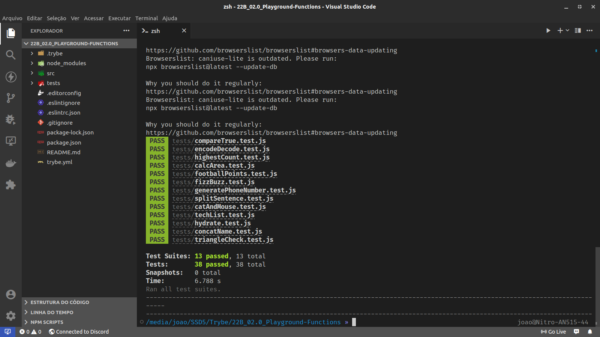

# Projeto Playground Functions
Este projeto, feito após o término do bloco 04 da Trybe, envolve a resolução de alguns desafios usando JavaScript. Esta foi a minha primeira experiência com JavaScript e foi muito desafiador resolvê-las tanto pela lógica, quanto para atender às exigências do linter.

# 